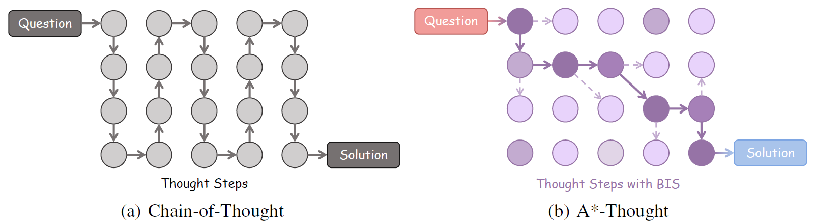
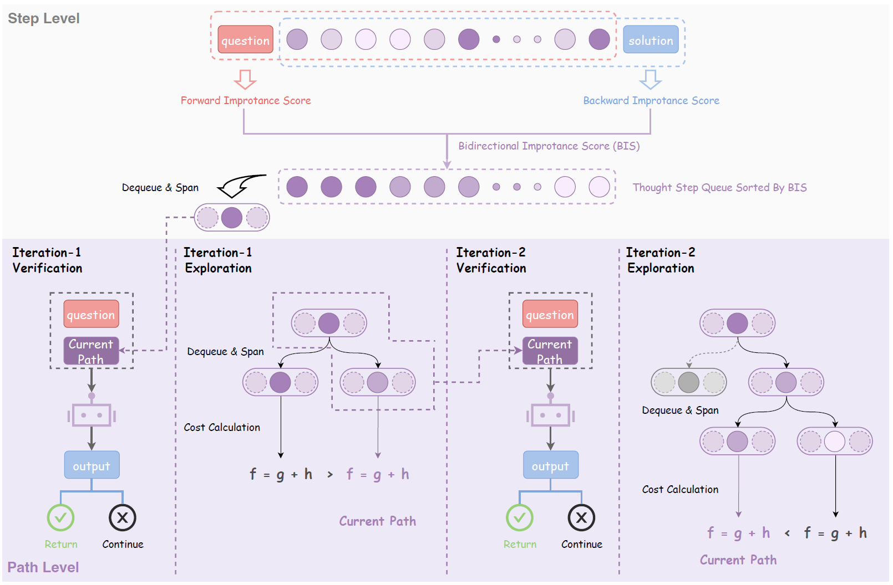
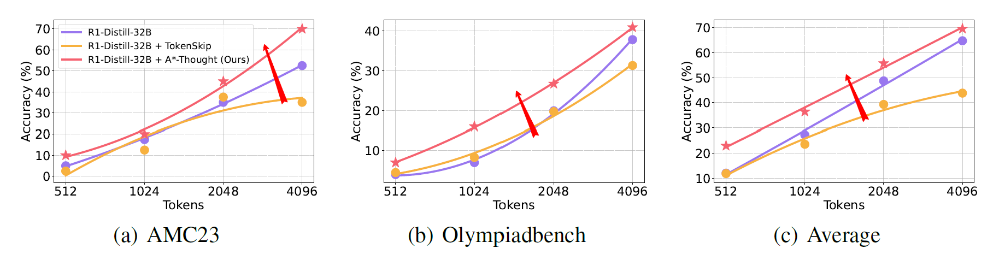
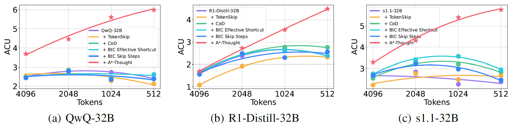

# <center>A*-Thought

Dataset:
[ **AStar-Thought-1k**](https://huggingface.co/datasets/xxang/AStar-Thought-1k)

Models:
[ **AStar-Thought-QwQ-32B**](https://huggingface.co/xxang/AStar-Thought-QwQ-32B)
[ **AStar-Thought-DeepSeek-R1-Distill-Qwen-32B**](https://huggingface.co/xxang/AStar-Thought-DeepSeek-R1-Distill-Qwen-32B)
[ **AStar-Thought-s1.1-32B**](https://huggingface.co/xxang/AStar-Thought-s1.1-32B)


## Introduction

A*-Thought introduces a unified framework designed to identify and isolate the most essential thoughts from the extensive reasoning chains produced by these models, automatically discovering compact and effective reasoning paths by leveraging signals at both step and path levels:
1. At the step level, a bidirectional importance estimation mechanism quantifies the significance of each thinking step based on its relevance to both the question and the prospective solution. 
2. At the path level, A* search is employed to efficiently navigate the exponential search space. This search utilizes cost functions that assess two key aspects: the quality of the current path and the conditional self-information of the solution given this path. These assessments collectively inform the estimated current and future cost to reach a desirable final solution.



A*-Thought could improve both the performance and the efficiency of LRMs (e.g., DeepSeek-R1-Distill-Qwen-32B, QwQ-32B) under different budgets:
1. Up to 2.39x accuracy and 2.49x ACU improvements in low-budget scenarios. Specifically, across all examined benchmarks, A*-Thought improve the average accuracy of QwQ-32B from 12.3 to 29.4 when the inference budget is constrained to 512 tokens. Concurrently, the ACU score improves from 2.41 to 5.99. Furthermore, in experiments with inference budgets of 1024 and 2048 tokens, A*-Thought consistently attained superior accuracy and the shortest response lengths.
2. Up to 33.59% length reduction without substantial accuracy drop in the 4096-token setting. For instance, for the QwQ-32B model, A*-Thought decreased the average response length from 2826.00 to 1876.66 tokens. This significant length reduction resulted in only a slight decrease in average accuracy (from 70.6% to 69.3%). Importantly, A*-Thought also attained the highest ACU score in this setting, outperforming both the prompt-based and the training based baselines. 
3. Compatible with several models, A*-Thought demonstrates generalizability. The results demonstrate A*-Thought's effectiveness across three distinct backbone models: QwQ-32B, R1-Distill-32B, and s1.1-32B, where it consistently achieves the highest ACU score under various budget conditions.







## Data and Model 

We open access to the following models trained on the [AStar-Thought-1k](https://huggingface.co/datasets/xxang/AStar-Thought-1k) dataset.

| Model                                      | HF Repo                                                                            | Description                                                   |
| ------------------------------------------ | ---------------------------------------------------------------------------------- | ------------------------------------------------------------- |
| AStar-Thought-QwQ-32B                      | [ HF Repo](https://huggingface.co/xxang/AStar-Thought-QwQ-32B)                      | **QwQ-32B** trained on the AStar-Thought-1k                      |
| AStar-Thought-DeepSeek-R1-Distill-Qwen-32B | [ HF Repo](https://huggingface.co/xxang/AStar-Thought-DeepSeek-R1-Distill-Qwen-32B) | **DeepSeek-R1-Distill-Qwen-32B** trained on the AStar-Thought-1k |
| AStar-Thought-s1.1-32B                     | [ HF Repo](https://huggingface.co/xxang/AStar-Thought-s1.1-32B)                     | **s1.1-32B** trained on the AStar-Thought-1k                     |


## Getting Started

```bash
pip install -r requirements.txt
cd LLaMA-Factory
pip install -e ".[torch,metrics]"
```
Please upgrade `vllm>=0.9.2` and `llama-factory>=0.9.4` to support [Qwen3](https://huggingface.co/collections/Qwen/qwen3-67dd247413f0e2e4f653967f).

## Compress Data

```bash
device_map="0,1,2,3,4,5,6,7"
CUDA_VISIBLE_DEVICES="${device_map}" \
    python long_cot_compress.py \
    --scorer_model_path "openai-community/gpt2" \
    --validator_model_path "simplescaling/s1.1-32B" \
    --data_path "simplescaling/s1K-1.1" \
    --cache_path "./res/cache/s1K-1.1-bis.jsonl" \
    --output_path "./res/data/s1K-1.1-compressed.jsonl" \
    --scorer_works_num 32 \
    --scorer_device_map "${device_map}" \
    --validator_device_map "${device_map}" \
    --thought_begin_tag "<|begin_of_thought|>" \
    --thought_end_tag "<|end_of_thought|>" \
    --solution_begin_tag "<|begin_of_solution|>" \
    --solution_end_tag "<|end_of_solution|>" \
    --alpha 0.5 \
    --beta 0.1 \
    --min_search_steps 5 \
    --max_search_steps 20 \
    --load_s1k
```
You could modify it in [`run_compress.sh`](https://github.com/AI9Stars/AStar-Thought/blob/main/run_compress.sh).

## Train

Write the compressed data path obtained in Step 1 to [`LLaMA-Factory/data/dataset_info.json`](https://github.com/AI9Stars/AStar-Thought/blob/main/LLaMA-Factory/data/dataset_info.json#L730-L743)
```bash
llamafactory-cli train examples/train_full/qwen2_full_sft.yaml
```
You could modify it in [`LLaMA-Factory/examples/train_full/qwen2_full_sft.yaml`](https://github.com/AI9Stars/AStar-Thought/blob/main/LLaMA-Factory/examples/train_full/qwen2_full_sft.yaml).

## Evaluate

Write the model path obtained in Step 2 [`astarthought/evals/models/model_configs.yaml`](https://github.com/AI9Stars/AStar-Thought/blob/main/astarthought/evals/models/model_configs.yaml#L144-L145)
```bash
CUDA_VISIBLE_DEVICES="0,1,2,3,4,5,6,7" \
python -m astarthought.evals.cli evaluate \
    --model "your model path here" \
    --task "math500" \
    --sampling-params temperature=0.6,top_p=0.95,max_tokens=1024 \
    --backend vllm \
    --backend-args tensor_parallel_size=8 \
    --result-dir ./res/eval
```
You could modify it in [`run_eval.sh`](https://github.com/AI9Stars/AStar-Thought/blob/main/run_eval.sh).

## Citation
Please cite our [paper](https://arxiv.org/abs/2505.24550v2) if you find our work valuable.

```bibtex
@misc{astarthought,
  title={A*-Thought: Efficient Reasoning via Bidirectional Compression for Low-Resource Settings}, 
  author={Xiaoang Xu and Shuo Wang and Xu Han and Zhenghao Liu and Huijia Wu and Peipei Li and Zhiyuan Liu and Maosong Sun and Zhaofeng He},
  journal={arXiv preprint arXiv:2505.24550v2},
  year={2025},
  url={https://arxiv.org/abs/2505.24550v2}, 
}
```
