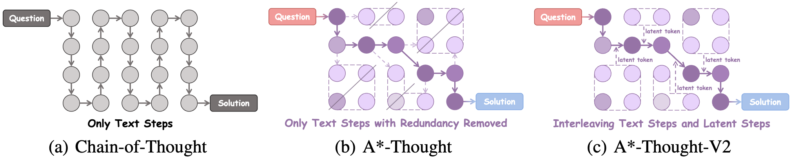
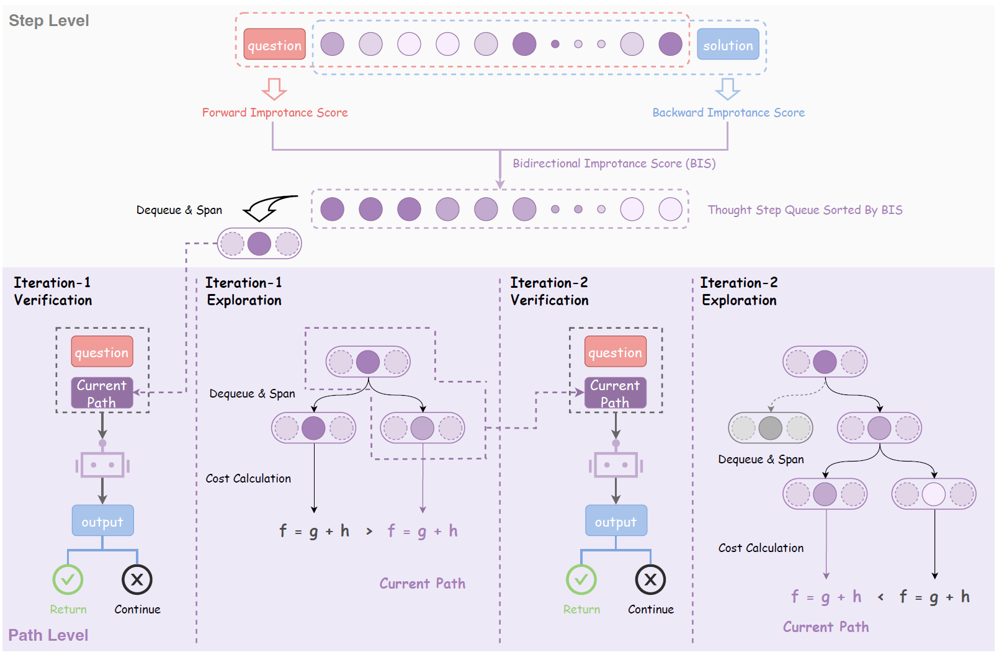
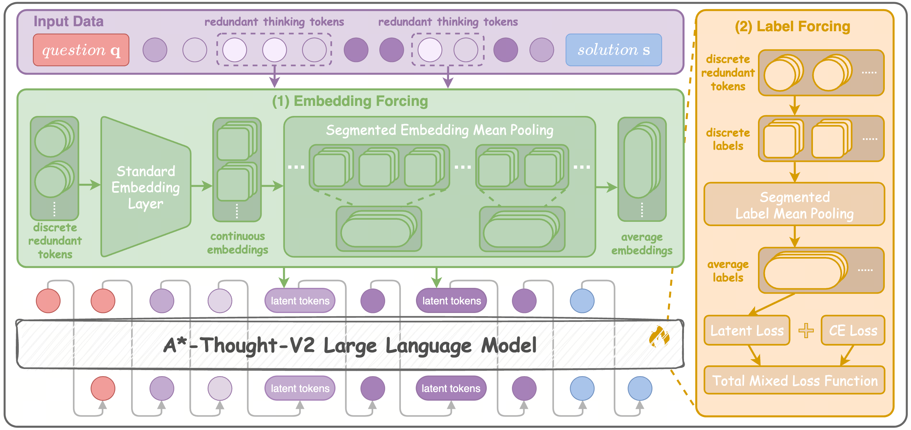

<p align="center">
  
</p>

<h1 align="center">☄️ A*-Thought</h1>

<p align="center">
  <strong>A*-Thought: Efficient Reasoning via Bidirectional Compression for Low-Resource Settings</strong>
</p>

<p align="center">
  <a href="https://arxiv.org/abs/2505.24550v2"></a>
  &nbsp;
  <a href="https://github.com/AI9Stars/AStar-Thought"></a>
  &nbsp;
  <a href="https://huggingface.co/collections/xxang/astar-thought"></a>
  &nbsp;
  <a href="https://openreview.net/forum?id=uvyr9bYwL6"></a>
</p>

<p align="center">
  <a href="#-resources">Resources</a> ·
  <a href="#-news">News</a> ·
  <a href="#-overview">Overview</a> ·
  <a href="#-quick-start">Quick Start</a> ·
  <a href="#-compress-data">Compress Data</a> ·
  <a href="#-train">Train</a> ·
  <a href="#-evaluate">Evaluate</a> ·
  <a href="#-citation">Citation</a>
</p>

## 📌 Resources

### 💫 A*-Thought

| Type | Name | Backbone | Hugging Face Repo | Description |
| :--- | :--- | :--- | :--- | :--- |
| **Dataset** | **AStar-Thought-1k** | s1.1-1k | [🤗 HF Data](https://huggingface.co/datasets/xxang/AStar-Thought-1k) | The training dataset used for A*-Thought model training. |
| **Model** | **AStar-Thought-QwQ-32B** | QwQ-32B | [🤗 HF Model](https://huggingface.co/xxang/AStar-Thought-QwQ-32B) | QwQ-32B trained on AStar-Thought-1k. |
| **Model** | **AStar-Thought-DeepSeek-R1-Distill-Qwen-32B** | DeepSeek-R1-Distill-Qwen-32B | [🤗 HF Model](https://huggingface.co/xxang/AStar-Thought-DeepSeek-R1-Distill-Qwen-32B) | DeepSeek-R1-Distill-Qwen-32B trained on AStar-Thought-1k. |
| **Model** | **AStar-Thought-s1.1-32B** | s1.1-32B | [🤗 HF Model](https://huggingface.co/xxang/AStar-Thought-s1.1-32B) | s1.1-32B trained on AStar-Thought-1k. |

### 💫 A*-Thought-V2

| Type | Name | Backbone | Hugging Face Repo | Description |
| :--- | :--- | :--- | :--- | :--- |
| **Dataset** | **AStar-Thought-V2-OpenR1-Math-3k** | OpenR1-Math-3k | [🤗 HF Data](https://huggingface.co/datasets/xxang/AStar-Thought-V2-OpenR1-Math-3k) | The training dataset used for A*-Thought-V2 model training. |
| **Model** | **AStar-Thought-V2-Qwen3.5-9B** | Qwen3.5-9B | [🤗 HF Model](https://huggingface.co/xxang/AStar-Thought-V2-Qwen3.5-9B) | Qwen3.5-9B trained on AStar-Thought-V2-OpenR1-Math-3k. |
| **Model** | **AStar-Thought-V2-Qwen3.6-27B** | Qwen3.6-27B | [🤗 HF Model](https://huggingface.co/xxang/AStar-Thought-V2-Qwen3.6-27B) | Qwen3.5-9B trained on AStar-Thought-V2-OpenR1-Math-3k. |

## 📜 News

- **[2025/09/19]** 🎉 A*-Thought has been accepted to **NeurIPS 2025**!
- **[2025/05/30]** 🎉 We released the [📄 paper](https://arxiv.org/abs/2505.24550v2), [💻 code](https://github.com/AI9Stars/AStar-Thought), and [🤗 models & datasets](https://huggingface.co/collections/xxang/astar-thought) of A*-Thought.


## 👀 Overview

### 💫 A*-Thought

<p align="center">
  
</p>

**A\*-Thought** introduces a unified framework for identifying and isolating the most essential thoughts from long reasoning chains produced by large reasoning models.

The method automatically discovers compact and effective reasoning paths by leveraging both **step-level** and **path-level** signals:

1. **Step-level bidirectional importance estimation**  
   A bidirectional importance estimation mechanism quantifies the significance of each thinking step according to its relevance to both the original question and the prospective solution.

2. **Path-level A\* search**  
   A\* search efficiently navigates the exponential search space. It uses cost functions to assess:
   - the quality of the current reasoning path;
   - the conditional self-information of the solution given the current path.

Together, these signals estimate both the current and future cost required to reach a desirable final solution.

### 💫 A*-Thought-V2

<p align="center">
  
</p>

**A\*-Thought-V2** is an explicit and implicit interleaved efficient reasoning architecture guided by LLM dynamics. By interweaving the introduction of implicit latent space reasoning in explicit text, it achieves lossless compression of CoT.

## 🚀 Quick Start

Install dependencies with `uv`:

```bash
cd LlamaFactory
uv pip install -e .
```

Install the modified `vllm` used by **A\*-Thought-V2**:

```bash
pip download --no-deps "vllm==0.17.0" -d path-to-wheel

cd vllm
VLLM_VERSION_OVERRIDE=0.17.0 \
VLLM_PRECOMPILED_WHEEL_LOCATION=path-to-wheel \
uv pip install .
```
> [!NOTE]
> Only **A\*-Thought-V2** requires the modified [`vllm`](https://github.com/AI9Stars/AStar-Thought/vllm), other options allow for the original [`vllm`](https://github.com/vllm-project/vllm).

Install remaining requirements:

```bash
uv pip install -r requirements.txt
```


## 📂 Compress Data

This repository supports two compression pipelines:

- **A\*-Thought**
- **A\*-Thought-V2**

### 💫 A*-Thought

Run the following command to compress long CoT data with the A*-Thought pipeline:

```bash
device_map="0,1,2,3,4,5,6,7"

CUDA_VISIBLE_DEVICES="${device_map}" \
python long_cot_compress_v1.py \
    --scorer_model_path "openai-community/gpt2" \
    --validator_model_path "simplescaling/s1.1-32B" \
    --data_path "simplescaling/s1K-1.1" \
    --cache_path "./saves/cache/s1K-1.1-bis.jsonl" \
    --output_path "./saves/data/AStar-Thought-s1K-1.1.jsonl" \
    --scorer_works_num 32 \
    --scorer_device_map "${device_map}" \
    --validator_device_map "${device_map}" \
    --thought_begin_tag "<|begin_of_thought|>" \
    --thought_end_tag "<|end_of_thought|>" \
    --solution_begin_tag "<|begin_of_solution|>" \
    --solution_end_tag "<|end_of_solution|>" \
    --alpha 0.5 \
    --beta 0.1 \
    --min_search_steps 5 \
    --max_search_steps 20 \
    --load_s1k
```

#### Key Hyperparameters

| Argument | Description |
| :--- | :--- |
| `--alpha` | Balances the question-side and solution-side weights in the Bidirectional Importance Score, ranging from `0` to `1`. |
| `--beta` | Controls the weight of the current cost function `G` in A\* search. |
| `--min_search_steps` | Minimum number of A\* search steps. |
| `--max_search_steps` | Maximum number of A\* search steps. |

You can modify the default configuration in:

- [`run_compress_v1.sh`](https://github.com/AI9Stars/AStar-Thought/blob/main/run_compress_v1.sh)

### 💫 A*-Thought-V2

Run the following command to compress long CoT data with the A*-Thought-V2 pipeline:

```bash
device_map="0,1,2,3,4,5,6,7"

CUDA_VISIBLE_DEVICES="${device_map}" \
python long_cot_compress_v2.py \
    --model_path "Qwen/Qwen3.5-0.8B" \
    --data_path "TeichAI/deepseek-v3.2-speciale-openr1-math-3k/deepseek-v3.2-speciale-openr1-math-3k.jsonl" \
    --device_map "${device_map}" \
    --works_num 8 \
    --trajectory_pca_cache_path "./saves/cache/trajectory-pca.jsonl" \
    --output_path "./saves/data/AStar-Thought-V2-OpenR1-Math-3k/train.jsonl" \
    --thought_begin_tag "<think>" \
    --thought_end_tag "</think>" \
    --pca_angle_threshold "90"
```

#### Key Hyperparameters

| Argument | Description |
| :--- | :--- |
| `--pca_angle_threshold` | Controls the strictness of retained thinking steps. The value ranges from `0` to `180`. |
| Lower threshold | Retains thinking steps more strictly, resulting in a higher compression rate. |
| Higher threshold | Retains thinking steps more leniently, resulting in a lower compression rate. |

You can modify the default configuration in:

- [`run_compress_v2.sh`](https://github.com/AI9Stars/AStar-Thought/blob/main/run_compress_v2.sh)


## 🔥 Train

Before training, write the compressed data path obtained from the compression step into:

- [`LLaMAFactory/data/dataset_info.json`](https://github.com/AI9Stars/AStar-Thought/blob/main/LLaMAFactory/data/dataset_info.json#L756-L785)


### 💫 A*-Thought

Train with the A*-Thought pipeline:

```bash
cd LlamaFactory
bash run_train_v1.sh
```

You can modify the training script in:

- [`LLaMAFactory/run_train_v1.sh`](https://github.com/AI9Stars/AStar-Thought/blob/main/LLaMAFactory/run_train_v1.sh)


### 💫 A*-Thought-V2

Train with the A*-Thought-V2 pipeline:

```bash
cd LlamaFactory
bash run_train_v2.sh
```

You can modify the training script in:

- [`LLaMAFactory/run_train_v2.sh`](https://github.com/AI9Stars/AStar-Thought/blob/main/LLaMAFactory/run_train_v2.sh)


## 💭 Evaluate

Before evaluation, write the model path obtained from the training step into:

- [`astarthought/evals/models/model_configs.yaml`](https://github.com/AI9Stars/AStar-Thought/blob/main/astarthought/evals/models/model_configs.yaml#L144-L145)


### 💫 A*-Thought

Evaluate an A*-Thought model with `vllm`:

```bash
CUDA_VISIBLE_DEVICES="0,1,2,3,4,5,6,7" \
python -m astarthought.evals.cli evaluate \
    --model "your model path here" \
    --task "math500" \
    --sampling-params temperature=0.6,top_p=0.95,max_tokens=1024 \
    --backend vllm \
    --backend-args tensor_parallel_size=8 \
    --result-dir ./saves/eval
```

You can modify the evaluation script in:

- [`run_eval_v1.sh`](https://github.com/AI9Stars/AStar-Thought/blob/main/run_eval_v1.sh)


### 💫 A*-Thought-V2

Evaluate an A*-Thought-V2 model with hyperparameter-controlled latent inference:

```bash
max_latent_count=4
max_latent_len=32

python -m astarthought.evals.cli evaluate \
    --task ${task} \
    --model ${model} \
    --backend vllm \
    --backend-args "tensor_parallel_size=8,gpu_memory_utilization=0.8,hf_overrides={'max_latent_count':${max_latent_count},'max_latent_len':${max_latent_len}}" \
    --sampling-params temperature=1.0,top_p=0.95,max_tokens=${max_tokens} \
    --result-dir ./saves/eval \
    --overwrite \
    --batch-size 512
```

#### Key Hyperparameters

| Argument | Description |
| :--- | :--- |
| `max_latent_count` | Maximum number of switches from text mode to latent mode. |
| `max_latent_len` | Maximum token length for a single latent-mode segment. |

You can modify the evaluation script in:

- [`run_eval_v2.sh`](https://github.com/AI9Stars/AStar-Thought/blob/main/run_eval_v2.sh)

For logs and results of evaluation, please refer to: [A*-Thought-V2 Experiments Results](https://drive.google.com/drive/folders/1-XYYT6Unh-iIG5ZWNzfy5BjAE99voors?usp=sharing).

## ✨ Citation

Please cite our paper if you find this work useful:

```bibtex
@inproceedings{xu2025astarthought,
  title     = {A*-Thought: Efficient Reasoning via Bidirectional Compression for Low-Resource Settings},
  author    = {Xiaoang Xu and Shuo Wang and Xu Han and Zhenghao Liu and Huijia Wu and Pei Pei Li and Zhiyuan Liu and Maosong Sun and Zhaofeng He},
  booktitle = {The Thirty-ninth Annual Conference on Neural Information Processing Systems},
  year      = {2025},
  url       = {https://openreview.net/forum?id=uvyr9bYwL6}
}
```